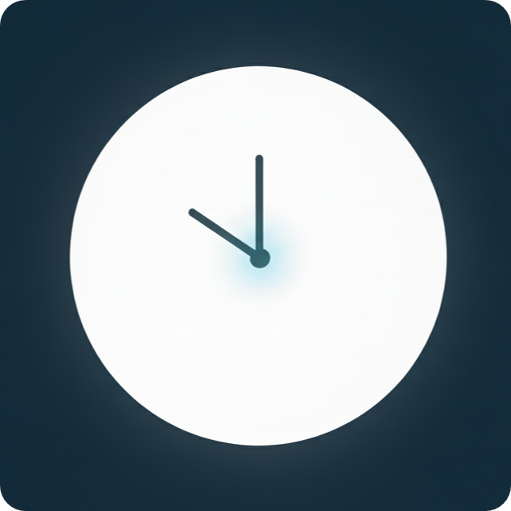
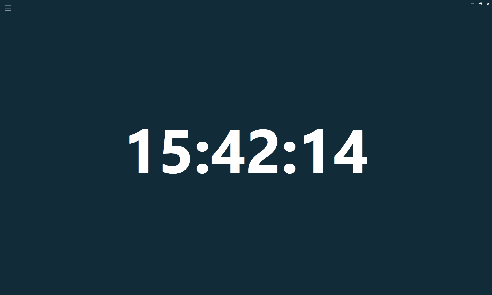
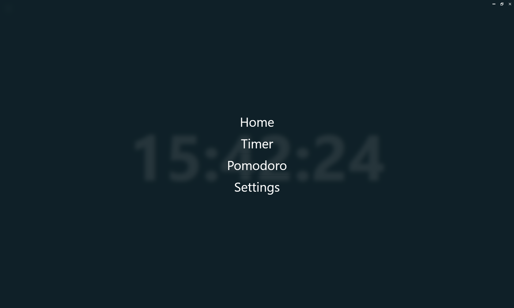
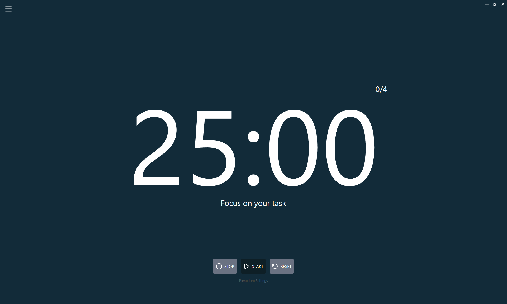
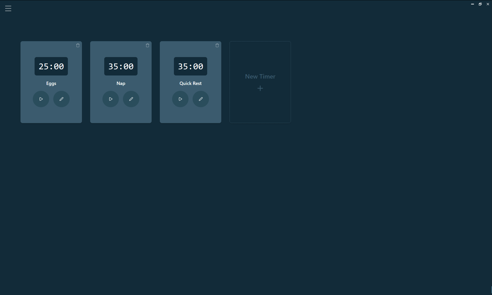
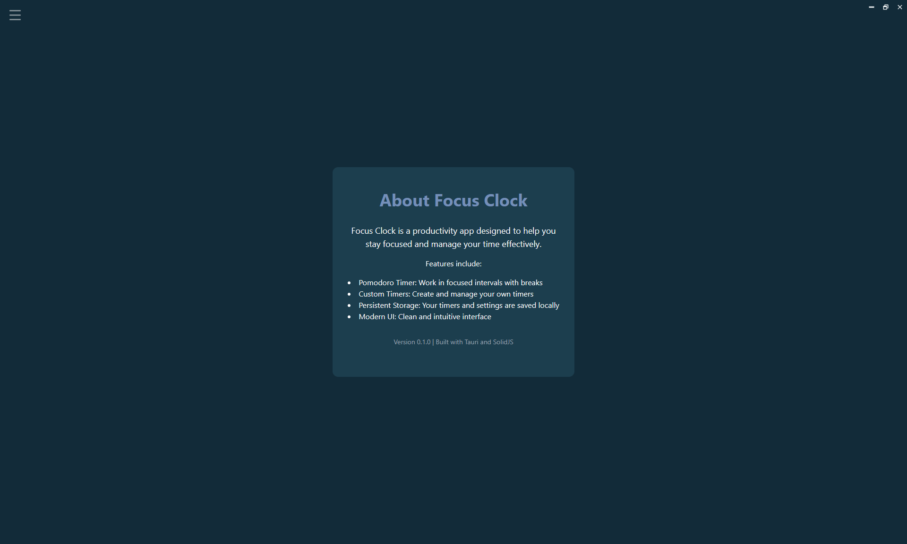

<h1 style="font-family: Arial, sans-serif; font-size: 36px; color: #E63946; display: flex; align-items: center; border-bottom: 3px solid #E63946; padding-bottom: 5px;">
    
    Focus Clock ⏳
</h1>

Focus Clock is a small desktop productivity timer app combining a Pomodoro-technique timer with
custom, user-created timers. Built with **Tauri**, **SolidJS**, and **TypeScript**, and designed to
sit on a second monitor as a lightweight companion so it doesn't clutter your main screen. This is
an early alpha release — it was built quickly and covers Phase 1 of its own roadmap.

---

## Tech Used 🧑‍💻


---

## Core Features ⚡

* 🍅 **Pomodoro Timer:**
  Configurable work/break intervals (`src/routes/pomodoro`).

* ⏲️ **Custom Timers:**
  Create, save, and manage multiple named timers (`src/routes/timer`).

* 💾 **Persistent Settings:**
  Timer configuration and preferences saved locally via `tauri-plugin-store`.

* 🎨 **Minimal UI:**
  Custom titlebar and a simple navigation menu, built with SolidJS + Tailwind CSS.

* 💻 **Lightweight:**
  Minimal Rust dependency footprint — no networking, just local settings storage.

---

## Screenshots 📸

<br>


**Home:** Overview of your timers and recent activity.

<br>


**Navigation Menu:** Quick minimal navigation menu without distractions.

<br>


**Pomodoro:** Start sessions with configurable intervals.

<br>


**Timer Gallery:** Manage your custom timers.

<br>


**Pomodoro Settings:** Save your Pomodoro preferences.

<br>


**About:** About page that describes the project.

---

## Project Structure 📂

```plaintext
src/
├── components/       # Reusable UI components (Titlebar, Navigation, ...)
├── routes/
│   ├── pomodoro/     # PomodoroMain, PomodoroSettings, usePomodoro
│   └── timer/        # TimerMain, TimerGallery, TimerCard, NewTimerCard, useTimer
├── config/           # store.ts — persistent settings
├── types/            # TypeScript types
└── style/            # Tailwind styles

src-tauri/            # Tauri backend (Rust) — minimal, store + serde only
├── src/
└── tauri.conf.json
```

---

## Setup and Development 🛠️

1. **Prerequisites:**

   * Node.js (v16+)
   * pnpm
   * Rust (latest stable)

2. **Install dependencies:**

   ```bash
   pnpm install
   ```

3. **Run in development mode:**

   ```bash
   pnpm tauri dev
   ```

4. **Build for production:**

   ```bash
   pnpm build
   pnpm tauri build
   ```

   The bundled app will be available under `src-tauri/target/release/`.

---

## Roadmap 🗺️

### Phase 1: Core Functionality — done

* [x] Pomodoro timer with intervals
* [x] Custom timers
* [x] Persistent settings

### Phase 2: Enhanced Features — not started

* [ ] Stats and reports
* [ ] Advanced theming
* [ ] Cloud sync

---

## Current Status

Alpha (`0.1.0`). Phase 1 is complete and working; Phase 2 items above haven't been started. There's
a leftover, unused `src/temp/settings.tsx` from an earlier settings rewrite that never got wired in.
