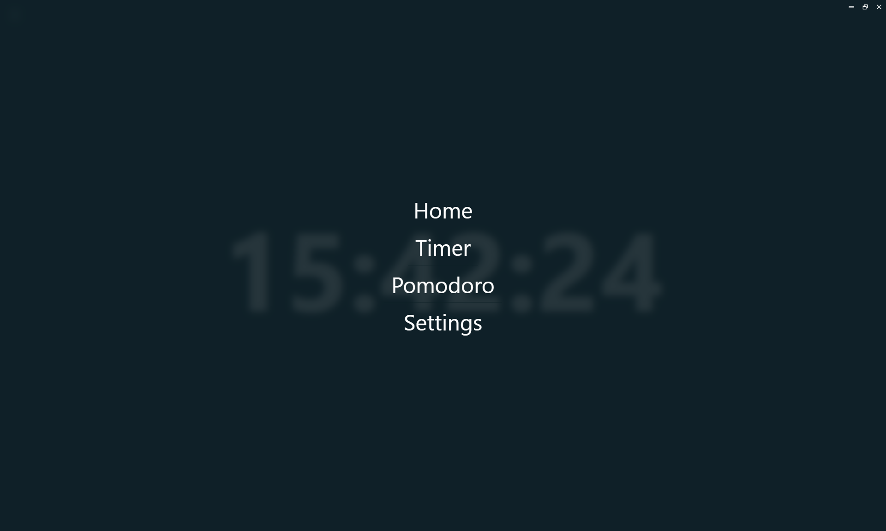

Got it ✅ — here’s your **Focus Clock README rewritten in the same style/structure as your Waldo Finder project**:

---

<h1 style="font-family: Arial, sans-serif; font-size: 36px; color: #E63946; display: flex; align-items: center; border-bottom: 3px solid #E63946; padding-bottom: 5px;">
    
    Focus Clock ⏳
</h1>

Focus Clock is a modern, cross-platform productivity timer app that helps you stay focused with customizable timers and Pomodoro sessions. Built with **Tauri**, **SolidJS**, and **TypeScript** for speed, simplicity, and local performance.

This app was built in just 2 hours and designed specifically for display on a second monitor to keep you focused without cluttering your main screen.

---

## Tech Used 🧑‍💻


---

## Core Features ⚡

* 🍅 **Pomodoro Timer:**
  Classic Pomodoro technique with customizable work/break intervals.

* ⏲️ **Custom Timers:**
  Create and manage multiple timers for different tasks.

* 🎨 **Modern UI:**
  Clean, responsive interface powered by SolidJS + TailwindCSS.

* 💻 **Cross-Platform:**
  Works on Windows, macOS, and Linux with Tauri backend.

* 💾 **Persistent Settings:**
  Your preferences and timer configurations are saved locally.

---

## Screenshots 📸

<br>


**Home:** Overview of your timers and recent activity.

<br>


**Navigation Menu:** Quick minimal navigation menu without distractions.

<br>


**Pomodoro:** Start sessions with configurable intervals.

<br>


**Timer Gallery:** Manage your custom timers.

<br>


**Pomodoro Settings:** Here you can save your pomodoro preferences.

<br>


**About:** About page that describes the project.

---

## Project Structure 📂

```plaintext
src/
├── components/       # Reusable UI components
├── routes/           # Pages and routing
├── hooks/            # Custom hooks for timer logic
├── config/           # App configuration
├── types/            # TypeScript types
└── style/            # TailwindCSS styles

src-tauri/            # Tauri backend (Rust)
├── src/              # Rust source code
└── tauri.conf.json   # Tauri config
```

---

## Setup and Development 🛠️

1. **Prerequisites:**

   * Node.js (v16+)
   * pnpm
   * Rust (latest stable)

2. **Clone and install dependencies:**

   ```sh
   git clone <repository-url>
   cd focus-clock
   pnpm install
   ```

3. **Run in development mode:**

   ```sh
   pnpm start
   ```

4. **Build for production:**

   ```sh
   pnpm build
   pnpm tauri build
   ```

   The app will be available in `src-tauri/target/release/`.

---

## Recommended IDE Setup 💻

* [VS Code](https://code.visualstudio.com/)
* [Tauri for VS Code](https://marketplace.visualstudio.com/items?itemName=tauri-apps.tauri-vscode)
* [rust-analyzer](https://marketplace.visualstudio.com/items?itemName=rust-lang.rust-analyzer)

---

## Contributing 👥

Contributions are welcome!
If you want to fix bugs, add features, or improve the codebase:

1. Fork the repo
2. Create a feature branch (`git checkout -b feature/MyFeature`)
3. Make your changes and test
4. Push and open a Pull Request

---

## Roadmap 🗺️

### Phase 1: Core Functionality

* [x] Pomodoro timer with intervals
* [x] Custom timers
* [x] Persistent settings

### Phase 2: Enhanced Features

* [ ] Stats and reports
* [ ] Advanced theming
* [ ] Cloud sync

---

## License ⚖️

MIT License – see `LICENSE` file for details.

---

## Contact 📬

* GitHub: [mohaneddz](https://github.com/mohaneddz)
* Email: [mohaned.manaa.dev@gmail.com](mailto:mohaned.manaa.dev@gmail.com)

---

Do you want me to also add **fancy shields for features (like Pomodoro, timers, cross-platform)** to make it match the “flashy” vibe of your old readme?
